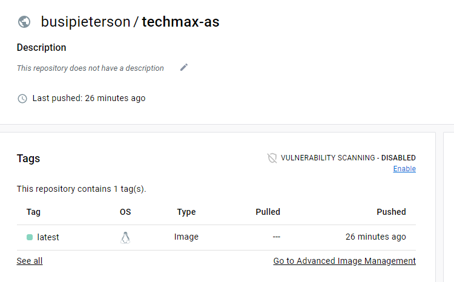

<h6>Built Docker Image and Pushed it to Docker Hub </h6>

- Created a Repository in Docker Hub
- Created the Dockerfile
- Created Shell Scripts
- Created Environment Variable
- Created the Buildspec File
- Created Personal Access Token
- Created Build Project in CodeBuild
- 

